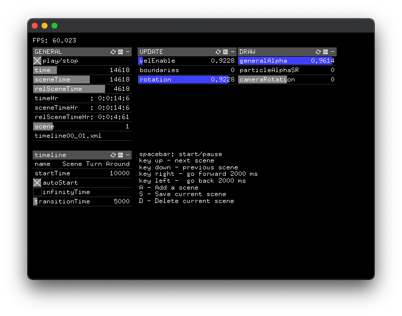

# ofxSceneManagerGui

OpenFrameworks addon to manage scenes using an ensemble of ofxGui params. It works great in combination with [ofxTransitionSlider](https://github.com/fusefactory/ofxTransitionSlider).

## Params

- **startTime**: time in ms of when scene needs to start
- **name**: name of the scene, it is print on the gui
- **autoStart**: if it true the scene starts automatically, if false the scene manager stop and you need to start manually.
- **infinityTime**: if true keep the current scene until you press the key to go to the next scene.
- **transitionTime**: time of all [ofxTransitionSlider](https://github.com/fusefactory/ofxTransitionSlider) for that scene.

 ## Consideration

For now, you have to create main scene manually, the scene manager allows you to generate only (sub) scenes using the keyboard. This could be improved in the future.

## Examples

### exampleSceneManger
A simple example to understand how to use the scene manager and how to organize files. 

- exampleSceneAudio - TODO